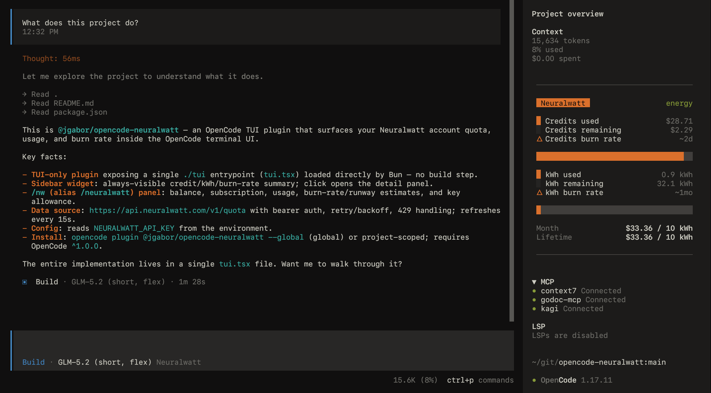
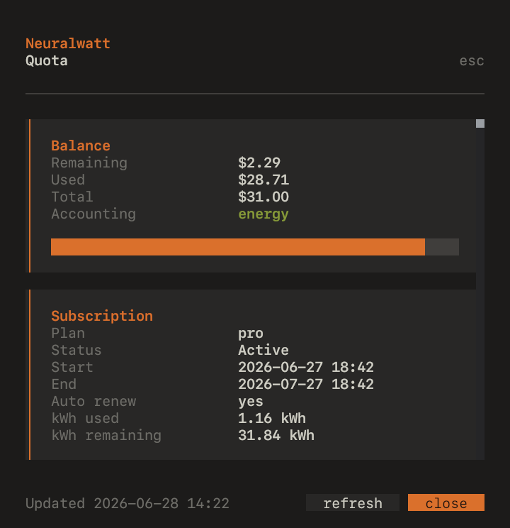

# opencode-neuralwatt

<p align="center">
  <picture>
    
  </picture>
</p>

An [OpenCode](https://opencode.ai/) TUI plugin that surfaces your [Neuralwatt](https://neuralwatt.com) account quota, usage, and burn rate directly inside the OpenCode terminal UI — as a sidebar widget and an on-demand `/nw` panel.

## Install

From the CLI:

```
opencode plugin @jgabor/opencode-neuralwatt --global
```

This installs the package and registers it in your global OpenCode TUI config (`~/.config/opencode/tui.json`).

Or, configure manually by editing `~/.config/opencode/tui.json`:

```jsonc
{
  "$schema": "https://opencode.ai/tui.json",
  "plugin": ["@jgabor/opencode-neuralwatt"],
}
```

Project-scoped install (omits `--global`) writes to `<repo>/.opencode/tui.json` instead.

## Configure

Set your Neuralwatt API key in your environment:

```
export NEURALWATT_API_KEY="nw_..."
```

The plugin reads `NEURALWATT_API_KEY` at startup and refreshes quota every 15s.

## Usage

<picture>
  
</picture>

- **Sidebar widget** — always-visible credit/kWh/burn-rate summary. Click it to open the detail panel.
- **`/nw`** (alias `/neuralwatt`) — opens the full quota panel (balance, subscription, usage, burn-rate estimates, key allowance). Use `refresh` / `close` footer buttons.

## Status fields shown

- Balance: remaining / used / total credits, accounting method (energy vs token)
- Subscription: plan, status, period, auto-renew, kWh used/remaining, overage
- Usage: current month and lifetime (cost, requests, tokens, energy)
- Burn rate: cost/day and estimated runway for both credits and kWh
- Key allowance: limit, period, spent, remaining, blocked

## How it works

The plugin is a TUI-only OpenCode plugin module, which is automatically loaded and executed with Bun. Quota data is fetched from `https://api.neuralwatt.com/v1/quota` with Bearer auth, retry/backoff, and 429 handling.

## Requirements

- OpenCode `^1.0.0`
- A Neuralwatt API key in `NEURALWATT_API_KEY`

---

**License:** [MIT](./LICENSE) · **Author:** [Jonathan Gabor](https://jgabor.se) · **Version:** 0.2.0
